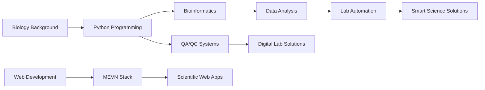

# Hi there! 👋 I'm Engki Nandatama

<div align="center">
  
</div>

## 🧬 About Me

Life sciences enthusiast with a **background in biology** and a growing passion for bridging the gap between **lab bench and digital innovation**. I'm on an exciting journey exploring how technology can revolutionize scientific research and quality systems.

```python
class CodeDrivenBiologist:
    def __init__(self):
        self.background = "Biology Graduate"
        self.tagline = "A Code-Driven Biologist"
        self.interests = ["Bioinformatics", "Data Science", "Lab Automation", "QA/QC Systems"]
        self.current_focus = "Integrating technology in life sciences"
        self.motto = "Code the invisible. Decode the impossible."
    
    def current_journey(self):
        return "Learning Python & exploring computational biology"
```

## 🔬 What I Do

- **🧪 Laboratory Experience**: Molecular biology and scientific analysis
- **💻 Tech Integration**: Exploring Python applications in bioinformatics
- **⚙️ Automation**: Experimenting with lab process automation
- **☁️ Cloud Tools**: Understanding data pipelines for scientific workflows
- **🔍 QA/QC**: Passionate about quality systems and traceability

## 🛠️ Tech Stack & Learning Journey

### Currently Learning


### Exploring


### Future Goals


## 🎯 Current Focus Areas



## 📫 Let's Connect!

<div align="center">
  
[](https://linkedin.com/in/engkinandatama)
[](https://engkinandatama.my.id)
[](mailto:engkinandatama@outlook.com)

</div>

---

<div align="center">
  
  
  ***"Where biology meets bytes, innovation begins."*** 🧬💻
</div>
