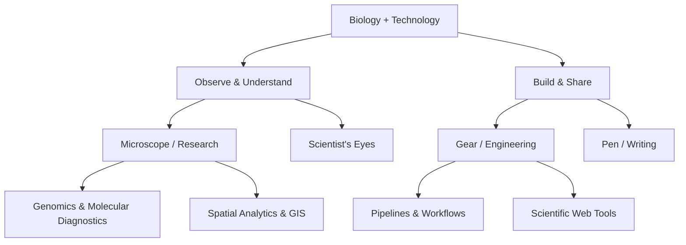

# Engki Nandatama

<div align="center">
  
</div>

---

## About Me

Computational biologist & research engineer based in Yogyakarta, Indonesia. I study biological systems, build computational tools for genomics and diagnostics, and communicate science.

```python
class ComputationalBiologist:
    def __init__(self):
        self.name = "Engki Nandatama"
        self.role = "Computational Biologist & Research Engineer"
        self.location = "Yogyakarta, Indonesia"
        self.pillars = ["Research", "Engineering", "Writing", "The Scientist's Eyes"]
        self.motto = "Observe. Understand. Build. Share."
    
    def current_focus(self):
        return [
            "Genomics & Molecular Diagnostics Tools",
            "Spatial Analytics & Environmental Modeling (GIS)",
            "Automated Scientific Workflows & Data Pipelines"
        ]
```

---

## Portfolio Pillars & Featured Projects

### Research
*Understanding biological systems through computation and spatial data.*
- **Genomics & Diagnostics**: RAA primer design for Influenza & AMR gene mobility analysis (`primerlab-genomic`, `AMR-gene-mobility`, `cre-mutation-map`).
- **Spatial Analytics (GIS)**: Flood mapping, deforestation, and tenure fire dynamics in Sumatra (`sumatra-flood-deforestation`, `sumatra-fire-tenure`).

### Engineering
*Building open-source software, pipelines, and automations for scientific discovery.*
- **Scientific Pipelines**: Nextflow nanopore 16S workflows (`wf-nanopore-16s-nextflow`, `txmineflow`).
- **Web & Tooling Infrastructure**: Web platforms and automation suites (`portfolio-2`, `studio-hub`, `core-studio`, `nimbus-render`, `ArthaFlow`).

### Writing
*Science communication, research notes, and technical articles bridging lab bench and digital innovation.*

### The Scientist's Eyes
*Visual observations, field notes, and spatial insights from biological and environmental research.*

---

## Tech Stack & Tools

### Core & Scripting


### Web & Frontend


### Data Science, ML & GIS


### Backend & Infrastructure


---

## Core Focus & Methodology


```mermaid
graph TD
    Root[Biology + Technology] --> Observe[Observe & Understand]
    Root --> Build[Build & Share]
    
    Observe --> Pilar1[Microscope / Research]
    Observe --> Pilar4[Scientist's Eyes]
    
    Pilar1 --> R1[Genomics & Molecular Diagnostics]
    Pilar1 --> R2[Spatial Analytics & GIS]
    
    Build --> Pilar2[Gear / Engineering]
    Build --> Pilar3[Pen / Writing]
    
    Pilar2 --> E1[Pipelines & Workflows]
    Pilar2 --> E2[Scientific Web Tools]
```

---

## Let's Connect

<div align="center">

[](https://linkedin.com/in/engkinandatama)&nbsp;&nbsp;
[](https://engkinandatama.my.id)&nbsp;&nbsp;
[](https://www.behance.net/engkinandatama)&nbsp;&nbsp;
[](https://www.kaggle.com/engkinandatama)\
[](https://orcid.org/0009-0003-7308-3900)&nbsp;&nbsp;
[](https://scholar.google.com/citations?user=TZZ4T2kAAAAJ&hl)&nbsp;&nbsp;
[](mailto:engkinandatama@outlook.com)

</div>

---

<div align="center">
  <em>"Observe. Understand. Build. Share."</em>
</div>

