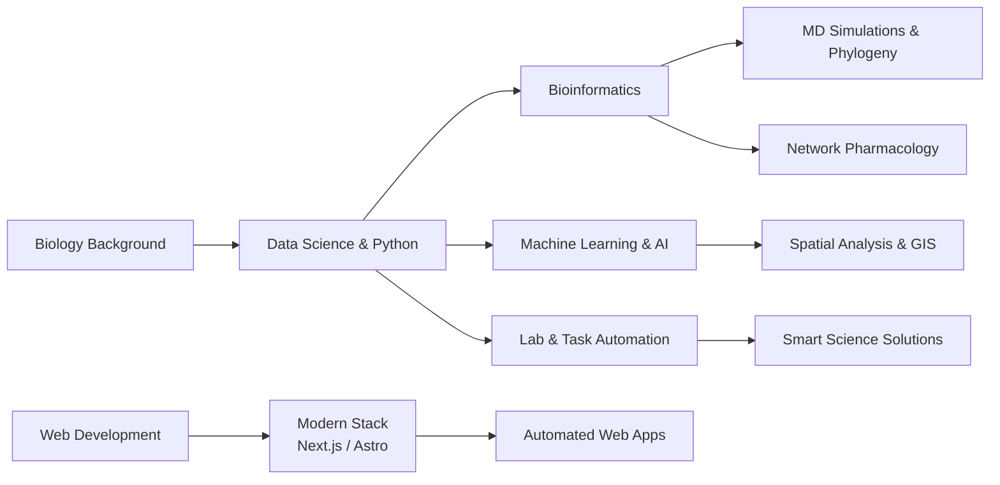

# Engki Nandatama

<div align="center">
  
</div>

---

## About Me

Life sciences enthusiast with a **background in biology** and a growing passion for bridging the gap between **lab bench and digital innovation**. I'm on an exciting journey exploring how technology can revolutionize scientific research and quality systems.

```python
class CodeDrivenBiologist:
    def __init__(self):
        self.background = "Biology Graduate"
        self.tagline = "A Code-Driven Biologist"
        self.interests = ["Bioinformatics", "Data Science", "Lab Automation", "QA/QC Systems"]
        self.current_focus = "Integrating technology in life sciences"
        self.motto = "Code the invisible. Decode the impossible."
    
    def current_journey(self):
        return "Learning Python & exploring computational biology"
```

---

## What I Do

- **Bio & Spatial Analytics**: Leveraging Data Science (ML) and GIS to solve complex biological and environmental challenges.
- **Modern Web Apps**: Building ultra-fast, scientific, and interactive portals using React, Next.js, and Astro.
- **Lab & Task Automation**: Developing robust workflow automations to streamline repetitive laboratory and data pipelines.
- **Bioinformatics Research**: Conducting *in-silico* studies like Molecular Dynamics (MD) simulations and Network Pharmacology.
- **QA/QC Systems**: Architecting digital traceability and quality management solutions for lab ecosystems.

---

## Tech Stack & Learning Journey

### Core & Scripting


### Web & Frontend


### Data Science, ML & GIS


### Backend & Infrastructure


---

## Current Focus Areas


```mermaid
graph LR
    A[Biology Background] --> B[Data Science & Python]
    
    %% Bioinformatics Path
    B --> C[Bioinformatics]
    C --> D[MD Simulations & Phylogeny]
    C --> N[Network Pharmacology]
    
    %% ML & GIS Path
    B --> M[Machine Learning & AI]
    M --> O[Spatial Analysis & GIS]
    
    %% Web Development Path
    B --> E[Lab & Task Automation]
    E --> F[Smart Science Solutions]
    
    G[Web Development] --> H[Modern Stack <br/> Next.js / Astro]
    H --> I[Automated Web Apps]
```

---

## Let's Connect

<div align="center">

[](https://linkedin.com/in/engkinandatama)&nbsp;&nbsp;
[](https://engkinandatama.my.id)&nbsp;&nbsp;
[](https://www.behance.net/engkinandatama)&nbsp;&nbsp;
[](https://www.kaggle.com/engkinandatama)\
[](https://orcid.org/0009-0003-7308-3900)&nbsp;&nbsp;
[](https://scholar.google.com/citations?user=TZZ4T2kAAAAJ&hl)&nbsp;&nbsp;
[](mailto:engkinandatama@outlook.com)

</div>

---

<div align="center">
  <em>"Where biology meets bytes, innovation begins."</em>
</div>
